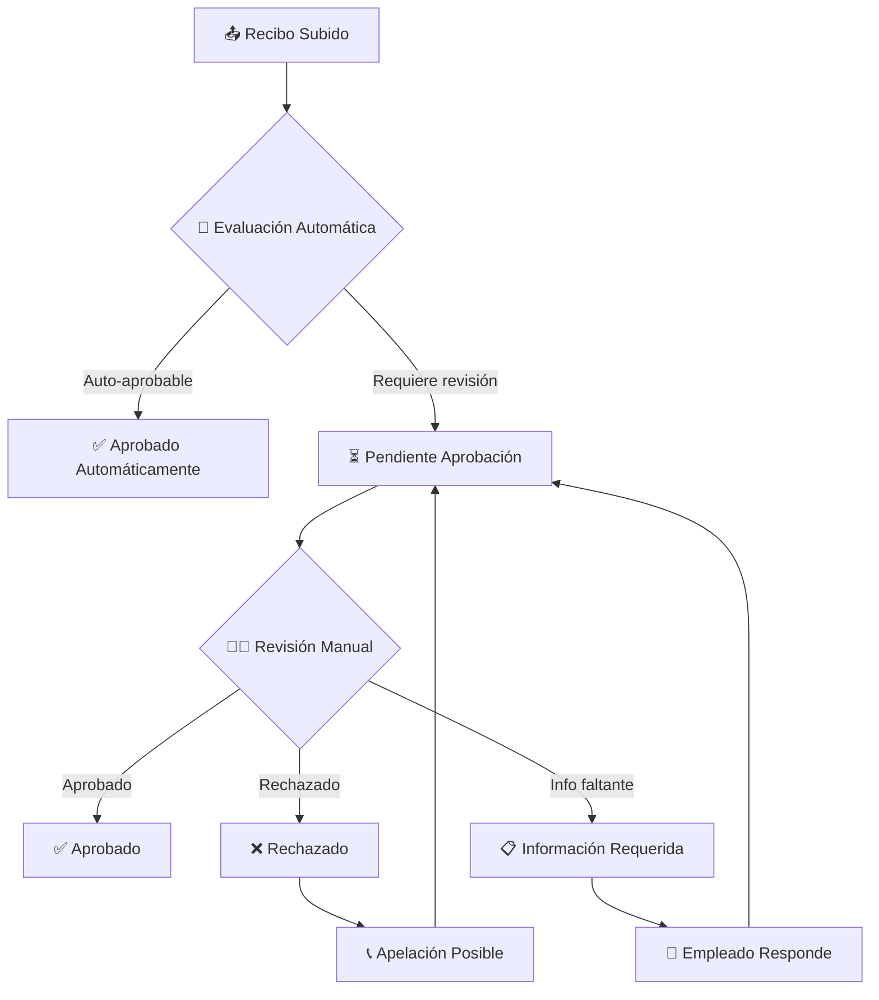

# 🔄 Sistema de Workflows de Aprobación - Guía de Usuario

## 🎯 **Introducción**

Los Workflows de Aprobación de Gastify automatizan el proceso de revisión y aprobación de gastos empresariales, permitiendo configurar reglas personalizadas basadas en montos, categorías, roles y jerarquías organizacionales.

## 👥 **Roles del Sistema**

### **Empleados** 👤
- ✅ Subir recibos con información automática (OCR + IA)
- ✅ Ver estado de aprobación en tiempo real
- ✅ Recibir notificaciones de cambios de estado
- ✅ Proporcionar información adicional si es solicitada
- ✅ Apelar rechazos con justificación

### **Aprobadores** 👨‍💼
- ✅ Revisar recibos pendientes de aprobación
- ✅ Aprobar/rechazar con comentarios
- ✅ Solicitar información adicional
- ✅ Ver historial completo de transacciones
- ✅ Configurar reglas de auto-aprobación

### **Administradores** 🏢
- ✅ Configurar reglas de workflow por empresa
- ✅ Asignar jerarquías de aprobación
- ✅ Definir límites por rol y categoría
- ✅ Monitorear métricas de eficiencia
- ✅ Generar reportes de compliance

## 🔄 **Estados del Workflow**



### **Descripción de Estados**

| Estado | Icono | Descripción | Acciones Disponibles |
|--------|-------|-------------|---------------------|
| **Borrador** | 📝 | Recibo en proceso de creación | Editar, Guardar, Enviar |
| **Pendiente** | ⏳ | Esperando aprobación | Ver estado, Contactar aprobador |
| **Revisión** | 👀 | Bajo revisión activa | Proporcionar info adicional |
| **Aprobado** | ✅ | Aprobado para reembolso | Ver detalles, Descargar |
| **Rechazado** | ❌ | Rechazado con motivo | Ver motivo, Apelar |
| **Info Req.** | 📋 | Información adicional necesaria | Completar, Reenviar |
| **Apelación** | 📞 | En proceso de apelación | Esperar resolución |

## ⚙️ **Configuración de Reglas**

### **Reglas de Auto-Aprobación**

#### **Por Monto y Categoría**
```json
{
  "name": "Gastos Menores Combustible",
  "conditions": {
    "category": "Combustible", 
    "amount_max": 50000,
    "currency": "CLP"
  },
  "action": "auto_approve",
  "applies_to": "all_employees"
}
```

#### **Por Rol de Usuario**
```json
{
  "name": "Ejecutivos Alto Monto",
  "conditions": {
    "user_role": "senior_executive",
    "amount_max": 500000,
    "categories": ["Restaurantes", "Transporte", "Hospedaje"]
  },
  "action": "auto_approve",
  "requires": ["receipt_photo", "business_justification"]
}
```

#### **Por Departamento**
```json
{
  "name": "Ventas Gastos Cliente", 
  "conditions": {
    "department": "Ventas",
    "category": "Restaurantes",
    "amount_max": 150000,
    "tags": ["cliente", "meeting"]
  },
  "action": "auto_approve",
  "notification": "manager_only"
}
```

### **Jerarquías de Aprobación**

#### **Estructura Simple**
```
💼 Empleado ($0 - $50k)
   ↓ Auto-aprobado
   
💼 Empleado ($50k - $200k)  
   ↓ Supervisor Directo
   
💼 Empleado ($200k - $500k)
   ↓ Supervisor → Gerente Área
   
💼 Empleado ($500k+)
   ↓ Supervisor → Gerente → Director
```

#### **Estructura Matricial**
```
🏢 Por Departamento y Monto:

📊 Marketing: 
├─ Hasta $100k → Coord. Marketing
├─ $100k-$300k → Gerente Marketing  
└─ $300k+ → Director Comercial

💰 Finanzas:
├─ Hasta $200k → Supervisor Finanzas
├─ $200k-$500k → Controller
└─ $500k+ → CFO

🔧 Operaciones:
├─ Hasta $75k → Jefe Turno
├─ $75k-$250k → Gerente Operaciones
└─ $250k+ → Director Operaciones
```

## 🚀 **Flujo Paso a Paso**

### **Para Empleados: Subir Recibo**

1. **Capturar/Subir Recibo**
   ```
   Gastify → Nuevo Recibo → 📷 Foto/Upload
   ```

2. **IA Procesa Automáticamente** 
   ```
   🤖 OCR extrae datos
   🧠 IA categoriza gasto
   📍 Geolocalización detecta comercio
   ⚡ Auto-completado formulario
   ```

3. **Completar Información**
   ```
   ✅ Verificar monto: $89.000
   ✅ Confirmar categoría: Combustible  
   ✅ Agregar justificación: "Visita cliente Valparaíso"
   ✅ Marcar como: Gasto empresa
   ```

4. **Envío y Evaluación Automática**
   ```
   🔄 Sistema evalúa reglas configuradas
   
   Resultado A: ✅ Auto-aprobado
   "Combustible $89k < límite $50k → Aprobado automáticamente"
   
   Resultado B: ⏳ Requiere aprobación
   "Monto excede límite → Enviado a Carlos Mendoza"
   ```

### **Para Aprobadores: Revisar Recibos**

1. **Dashboard de Pendientes**
   ```
   📋 Recibos Pendientes (8)
   ┌─────────────────────────────────────┐
   │ María G. | $156k | Restaurante | 2h │
   │ Juan P.  | $89k  | Combustible | 4h │  
   │ Ana L.   | $234k | Hospedaje   | 1d │
   └─────────────────────────────────────┘
   
   🎯 Filtros: [Empleado] [Monto] [Categoría] [Tiempo]
   ```

2. **Revisión Detallada**
   ```
   👤 Empleado: María González (Ventas)
   💰 Monto: $156.000 CLP
   🏪 Comercio: Restaurante Puerto Madero
   📅 Fecha: 15/01/2024 20:30
   📍 Ubicación: Las Condes, Santiago
   💼 Justificación: "Cena con cliente potencial - Proyecto Q1"
   
   📄 Documentos:
   ├─ 📷 Foto recibo original
   ├─ 🧾 Datos OCR extraídos  
   └─ 📋 Formulario completado
   ```

3. **Acciones de Aprobación**
   ```
   ✅ [Aprobar] 
      └─ Comentario: "Aprobado - Gasto justificado"
      
   ❌ [Rechazar]
      └─ Motivo: [Lista desplegable]
         ├─ Excede política empresa
         ├─ Falta justificación business
         ├─ Categoría no autorizada
         ├─ Duplicado
         └─ Otro (especificar)
         
   📋 [Solicitar Info]
      └─ Mensaje: "Por favor adjuntar agenda meeting"
   ```

## 📊 **Dashboard y Métricas**

### **Vista Empleado**
```
📈 Mi Panel de Gastos
┌─────────────────────────────────────┐
│ 📤 Enviados este mes: 12            │
│ ✅ Aprobados: 10                    │  
│ ⏳ Pendientes: 2                    │
│ ❌ Rechazados: 0                    │
└─────────────────────────────────────┘

⏱️ Tiempos Promedio:
├─ Auto-aprobación: 2 minutos
├─ Aprobación manual: 4.2 horas  
└─ Tu promedio histórico: 3.8 horas

🎯 Consejos Personalización:
• 95% de tus gastos combustible se auto-aprueban
• Agregar más detalle en restaurantes acelera aprobación
• Tu supervisor revisa más rápido martes-jueves
```

### **Vista Aprobador**
```
👨‍💼 Panel Aprobaciones - Carlos Mendoza
┌─────────────────────────────────────┐
│ ⏳ Pendientes: 8 recibos            │
│ ⏰ Más antiguo: 6 horas             │
│ 🎯 Meta SLA: < 4 horas             │
│ 📊 Cumplimiento: 94%               │
└─────────────────────────────────────┘

📈 Estadísticas (Último Mes):
├─ Total revisados: 156
├─ Aprobados: 142 (91%)
├─ Rechazados: 14 (9%) 
├─ Info solicitada: 23
└─ Tiempo promedio: 2.8 horas

🏆 Top Empleados por Eficiencia:
├─ 1. Ana López: 98% auto-aprobados
├─ 2. Juan Pérez: 95% auto-aprobados  
└─ 3. María González: 87% auto-aprobados
```

### **Vista Administrador**
```
🏢 Dashboard Empresa - Workflows Globales
┌─────────────────────────────────────────┐
│ 📊 Eficiencia Global: 96.2%            │
│ ⚡ Auto-aprobaciones: 78%              │
│ ⏱️ Tiempo promedio: 3.1 horas          │
│ 💰 Monto procesado mes: $45.2M         │
└─────────────────────────────────────────┘

🎯 KPIs Críticos:
├─ SLA < 4h: 96% cumplimiento ✅
├─ Recibos digitalizados: 100% ✅  
├─ Compliance políticas: 98% ✅
└─ Satisfacción empleados: 4.7/5 ✅

⚠️ Alertas Activas:
├─ Departamento Legal: 12h promedio (excede SLA)
├─ Categoría "Tecnología": 45% rechazos  
└─ Usuario "Roberto Silva": 8 recibos pendientes
```

## 🤖 **Reglas Inteligentes Chilenas**

### **Templates Predefinidos Chile**

#### **Empresa Retail**
```yaml
name: "Retail Chile Standard"
rules:
  - combustible_vendedores:
      category: "Combustible" 
      role: ["Vendedor", "Supervisor Ventas"]
      amount_max: 80000
      auto_approve: true
      
  - comidas_ejecutivos:
      category: "Restaurantes"
      role: ["Gerente", "Director"] 
      amount_max: 120000
      requires_client_info: true
      
  - tecnologia_ti:
      category: "Tecnología"
      department: "TI"
      amount_max: 500000
      approvers: ["CTO", "Director Finanzas"]
```

#### **Empresa Servicios**
```yaml
name: "Servicios Profesionales Chile"
rules:
  - transporte_consultores:
      categories: ["Transporte", "Hospedaje"]
      role: "Consultor"
      client_billable: true
      auto_approve: true
      
  - representacion_comercial:
      category: "Restaurantes"  
      department: "Comercial"
      requires: ["cliente", "oportunidad_crm"]
      amount_max: 200000
```

### **Validaciones Automáticas Chile**

#### **Compliance Fiscal**
```javascript
// Validaciones automáticas específicas Chile
const chileValidations = {
  rut_validation: true,          // Verificar RUT emisor válido
  sii_integration: true,         // Validar con base SII 
  iva_calculation: true,         // Verificar cálculo IVA 19%
  folio_uniqueness: true,        // Detectar folios duplicados
  authorized_issuer: true        // Verificar emisor autorizado SII
}
```

#### **Detección Anomalías**
```javascript
const anomalyDetection = {
  unusual_amounts: {
    factor: 2.5,                 // >250% del promedio histórico
    categories: ["Restaurantes", "Retail"]
  },
  
  geographic_anomalies: {
    max_distance_km: 500,        // Máximo 500km del workplace
    verify_business_travel: true  
  },
  
  time_patterns: {
    business_hours_only: false,   // Permitir gastos fuera horario
    weekend_limit: 100000        // Límite gastos fin semana
  }
}
```

## 📱 **Integración Mobile**

### **App Móvil - Funcionalidades**

#### **Para Empleados**
```
📱 Gastify Mobile
├─ 📷 Captura Inmediata
│   ├─ Auto-OCR en device
│   ├─ Upload background
│   └─ Notificación cuando procesado
│   
├─ 🔔 Notificaciones Push
│   ├─ Estado cambios
│   ├─ Solicitudes info
│   └─ Aprobaciones recibidas
│   
└─ 📊 Dashboard Móvil
    ├─ Estado recibos
    ├─ Límites actuales
    └─ Historial gastos
```

#### **Para Aprobadores**
```
👨‍💼 Aprobaciones Móvil  
├─ 🚨 Notificaciones Urgentes
│   ├─ Push inmediato para >$500k
│   ├─ Resumen diario pendientes
│   └─ Alertas SLA (>4h sin revisar)
│   
├─ ⚡ Aprobación Rápida
│   ├─ Swipe aprobar/rechazar
│   ├─ Templates comentarios
│   └─ Aprobación por lotes
│   
└─ 📊 Stats en Tiempo Real
    ├─ Pendientes actuales
    ├─ Métricas semanales
    └─ Alertas departamento
```

## 🔒 **Seguridad y Auditoría**

### **Trail de Auditoría**
```json
{
  "receipt_id": "RCP-2024-001456",
  "audit_trail": [
    {
      "timestamp": "2024-01-15T14:30:00Z",
      "action": "created",
      "user": "maria.gonzalez@empresa.cl",
      "details": {
        "amount": 156000,
        "category": "Restaurantes",
        "location": "Las Condes, Santiago"
      }
    },
    {
      "timestamp": "2024-01-15T14:32:15Z", 
      "action": "auto_evaluation_completed",
      "system": "workflow_engine",
      "result": "requires_approval",
      "assigned_to": "carlos.mendoza@empresa.cl"
    },
    {
      "timestamp": "2024-01-15T16:45:30Z",
      "action": "approved", 
      "user": "carlos.mendoza@empresa.cl",
      "comment": "Gasto justificado - Cliente confirmado en CRM"
    }
  ]
}
```

### **Controles de Acceso**
```yaml
permissions:
  employee:
    - create_receipt
    - view_own_receipts  
    - appeal_rejection
    
  supervisor:
    - approve_team_receipts
    - request_additional_info
    - view_team_analytics
    
  manager:  
    - approve_high_amounts
    - configure_team_rules
    - access_department_reports
    
  admin:
    - configure_global_rules
    - access_audit_logs
    - modify_user_permissions
```

## 🎯 **Mejores Prácticas**

### **Configuración Inicial**
1. **Mapear Estructura Organizacional**
   - Definir jerarquías claras
   - Asignar roles y responsabilidades
   - Establecer límites por posición

2. **Configurar Reglas Graduales**
   - Comenzar con reglas conservadoras
   - Aumentar auto-aprobaciones según confianza
   - Monitorear y ajustar mensualmente

3. **Capacitar Usuarios**
   - Training inicial para empleados
   - Certificación para aprobadores  
   - Documentación siempre disponible

### **Optimización Continua**
1. **Análisis de Métricas**
   - Revisar tiempos de aprobación semanalmente
   - Identificar cuellos de botella
   - Optimizar reglas basado en datos

2. **Feedback Loop**
   - Encuestas satisfacción trimestrales
   - Sessions feedback con aprobadores
   - Implementar mejoras sugeridas

3. **Compliance y Auditoría**
   - Revisión políticas semestralmente
   - Auditorías externas anuales
   - Documentar todos los cambios

## 📞 **Soporte Técnico**

```
🆘 Soporte Workflows
├─ 📧 workflows@gastify.cl
├─ 📱 WhatsApp: +56 9 8765 4321
├─ 💬 Chat: gastify.cl/soporte-workflows
└─ 📞 Urgencias: +56 2 2890 1234

⏰ Horarios:
├─ Lun-Vie: 8:00-20:00 CLT
├─ Sábados: 9:00-14:00 CLT  
└─ Urgencias: 24/7 (solo críticas)

📋 Escalamiento:
├─ Nivel 1: Soporte General (0-2h)
├─ Nivel 2: Técnico Especialista (2-8h)
└─ Nivel 3: Engineering Team (8-24h)
```

---

*Última actualización: Enero 2024*
*Versión: 2.0.0*
*Compatible con: Normativa SII Chile, IFRS, SOX*
