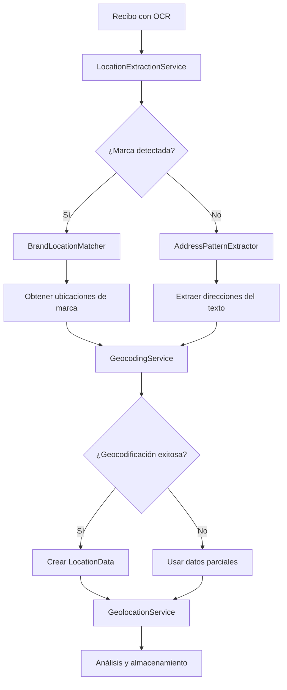

# 🔧 Documentación Técnica - Sistema de Geolocalización

## Arquitectura del Sistema

### Componentes Principales

```
┌─────────────────────────────────────────────────────────────┐
│                    SISTEMA DE GEOLOCALIZACIÓN               │
├─────────────────────────────────────────────────────────────┤
│                                                             │
│  ┌─────────────────┐  ┌─────────────────┐  ┌──────────────┐ │
│  │ LocationExtract │  │ GeocodingService│  │ GeolocationS │ │
│  │ ionService      │  │                 │  │ ervice       │ │
│  │                 │  │                 │  │              │ │
│  │ • Extrae texto  │  │ • Google Maps   │  │ • Orquestador│ │
│  │ • Detecta marcas│  │ • Caché local   │  │ • Analytics  │ │
│  │ • Patrones      │  │ • Rate limiting │  │ • Heatmaps   │ │
│  │ • Confianza     │  │ • Retry logic   │  │ • Trips      │ │
│  └─────────────────┘  └─────────────────┘  └──────────────┘ │
│           │                     │                    │      │
│           └─────────────────────┼────────────────────┘      │
│                                 │                           │
│  ┌─────────────────┐  ┌─────────────────┐  ┌──────────────┐ │
│  │ BrandLocation   │  │ AddressPattern  │  │ PhoneNumber  │ │
│  │ Matcher         │  │ Extractor       │  │ Extractor    │ │
│  │                 │  │                 │  │              │ │
│  │ • 100+ marcas   │  │ • Regex patterns│  │ • Formatos   │ │
│  │ • Ubicaciones   │  │ • Direcciones   │  │ • Validación │ │
│  │ • Distancias    │  │ • Comunas       │  │ • Normalizar │ │
│  └─────────────────┘  └─────────────────┘  └──────────────┘ │
│                                                             │
└─────────────────────────────────────────────────────────────┘
```

### Flujo de Procesamiento



## Modelos de Datos

### LocationDataModel
```python
@dataclass
class LocationDataModel:
    location: Dict[str, Any]          # Datos de ubicación completos
    extraction_method: str            # Método usado: brand_matched, address_extracted, etc.
    confidence: float                 # Confianza 0.0-1.0
    created_at: datetime = field(default_factory=datetime.utcnow)
    updated_at: datetime = field(default_factory=datetime.utcnow)
```

### Location
```python
@dataclass
class Location:
    id: Optional[str] = None
    coordinates: Optional[Coordinates] = None
    address: Optional[Address] = None
    metadata: Optional[LocationMetadata] = None
    location_type: LocationType = LocationType.OTHER
    source: LocationSource = LocationSource.MANUAL
    confidence: float = 1.0
    created_at: datetime = field(default_factory=datetime.utcnow)
    updated_at: datetime = field(default_factory=datetime.utcnow)
```

### Coordinates
```python
@dataclass
class Coordinates:
    latitude: float
    longitude: float
    accuracy: Optional[float] = None  # Precisión en metros
    altitude: Optional[float] = None
    
    def distance_to(self, other: 'Coordinates') -> float:
        """Calcula distancia usando fórmula de Haversine"""
```

## Servicios Principales

### LocationExtractionService

**Responsabilidades:**
- Extraer información de ubicación del texto OCR
- Detectar marcas conocidas y asociar ubicaciones
- Extraer direcciones usando patrones regex
- Calcular confianza de la extracción

**Métodos principales:**
```python
async def extract_location_from_text(self, text: str) -> LocationExtractionResult
async def get_best_location(self, extraction: LocationExtractionResult) -> Optional[Location]
```

**Patrones de extracción:**
```python
# Direcciones chilenas
ADDRESS_PATTERNS = [
    r'(?:Av\.|Avenida|Calle)\s+([A-Za-zÀ-ÿ\s]+)\s+(\d+)',
    r'([A-Za-zÀ-ÿ\s]+)\s+(\d+)(?:\s*,\s*([A-Za-zÀ-ÿ\s]+))?',
    r'(?:Mall|Centro Comercial)\s+([A-Za-zÀ-ÿ\s]+)'
]

# Teléfonos chilenos
PHONE_PATTERNS = [
    r'\+56\s*[2-9]\s*\d{4}\s*\d{4}',
    r'[2-9]\s*\d{4}\s*\d{4}',
    r'\(\d{2}\)\s*\d{4}\s*\d{4}'
]
```

### GeocodingService

**Responsabilidades:**
- Geocodificar direcciones usando Google Maps API
- Geocodificación inversa (coordenadas → dirección)
- Caché local para optimizar requests
- Rate limiting y retry logic

**Configuración:**
```python
class GeocodingConfig:
    api_key: str = os.getenv("GOOGLE_MAPS_API_KEY")
    cache_size: int = int(os.getenv("GEOCODING_CACHE_SIZE", "1000"))
    cache_ttl_hours: int = int(os.getenv("GEOCODING_CACHE_TTL_HOURS", "24"))
    rate_limit_per_minute: int = 100
    max_retries: int = 3
```

**Caché:**
```python
class GeocodingCache:
    def __init__(self, max_size: int = 1000, ttl_hours: int = 24):
        self.cache: Dict[str, GeocodingCacheEntry] = {}
        self.max_size = max_size
        self.ttl = timedelta(hours=ttl_hours)
    
    def get(self, key: str) -> Optional[Location]:
        """Obtiene entrada del caché si no ha expirado"""
    
    def set(self, key: str, location: Location) -> None:
        """Guarda entrada en caché con TTL"""
```

### GeolocationService

**Responsabilidades:**
- Orquestar todo el proceso de geolocalización
- Generar análisis geográficos
- Detectar viajes de negocios
- Crear datos para mapas de calor

**Análisis implementados:**
```python
class GeolocationAnalytics:
    def calculate_location_stats(self, receipts: List[ReceiptWithLocationModel]) -> Dict
    def generate_heatmap_data(self, receipts: List[ReceiptWithLocationModel]) -> List[HeatmapPoint]
    def detect_business_trips(self, receipts: List[ReceiptWithLocationModel]) -> List[BusinessTrip]
```

## Algoritmos de Detección

### Detección de Marcas

```python
def detect_brands(self, text: str) -> List[str]:
    """
    Detecta marcas conocidas en el texto usando:
    1. Coincidencia exacta (case-insensitive)
    2. Coincidencia parcial con threshold
    3. Patrones específicos por marca
    """
    brands_found = []
    text_normalized = self._normalize_text(text)
    
    for brand, patterns in self.brand_patterns.items():
        for pattern in patterns:
            if re.search(pattern, text_normalized, re.IGNORECASE):
                brands_found.append(brand)
                break
    
    return brands_found
```

### Cálculo de Confianza

```python
def calculate_confidence(self, extraction: LocationExtractionResult) -> float:
    """
    Calcula confianza basada en:
    - Presencia de marca conocida: +0.4
    - Dirección extraída: +0.3
    - Teléfono válido: +0.2
    - Palabras clave de ubicación: +0.1
    """
    confidence = 0.0
    
    if extraction.brands:
        confidence += 0.4
    if extraction.addresses:
        confidence += 0.3
    if extraction.phone_numbers:
        confidence += 0.2
    if extraction.location_keywords:
        confidence += 0.1
    
    return min(confidence, 1.0)
```

### Detección de Viajes de Negocios

```python
def detect_business_trips(self, receipts: List[ReceiptWithLocationModel]) -> List[BusinessTrip]:
    """
    Algoritmo de detección:
    1. Agrupar recibos por fecha y ubicación
    2. Identificar ubicaciones alejadas del hogar (>50km)
    3. Buscar patrones consecutivos (>1 día)
    4. Analizar categorías típicas de viaje
    5. Calcular confianza basada en patrones
    """
```

## Base de Datos

### Esquema de Recibo Extendido

```javascript
// Colección: receipts
{
  "_id": ObjectId,
  "user": ObjectId,
  "companyName": String,
  "folioNumber": String,
  "date": Date,
  "description": String,
  "totalAmount": Number,
  "imageUrl": String,
  "ocrData": {
    "vendor": String,
    "total_amount": Number,
    "date": String,
    "items": [String],
    "raw_text": String,
    "confidence": Number
  },
  "locationData": {                    // ← NUEVO
    "location": {
      "coordinates": {
        "latitude": Number,
        "longitude": Number,
        "accuracy": Number
      },
      "address": {
        "formatted_address": String,
        "street": String,
        "city": String,
        "state": String,
        "country": String
      },
      "metadata": {
        "place_name": String,
        "place_id": String,
        "brand": String,
        "category": String
      }
    },
    "extraction_method": String,       // brand_matched, address_extracted, etc.
    "confidence": Number,              // 0.0 - 1.0
    "created_at": Date,
    "updated_at": Date
  },
  "status": String,
  "createdAt": Date,
  "updatedAt": Date
}
```

### Índices Recomendados

```javascript
// Índices para optimizar consultas de geolocalización
db.receipts.createIndex({ "user": 1, "locationData.location.coordinates": "2dsphere" })
db.receipts.createIndex({ "user": 1, "date": 1, "locationData": 1 })
db.receipts.createIndex({ "locationData.location.metadata.brand": 1 })
db.receipts.createIndex({ "locationData.extraction_method": 1 })
```

## Configuración y Deployment

### Variables de Entorno

```env
# Google Maps API
GOOGLE_MAPS_API_KEY=your_api_key_here

# Caché de geocodificación
GEOCODING_CACHE_SIZE=1000
GEOCODING_CACHE_TTL_HOURS=24

# Límites de rate
GEOCODING_RATE_LIMIT_PER_MINUTE=100

# Configuración de viajes de negocios
BUSINESS_TRIP_MIN_DISTANCE_KM=50
BUSINESS_TRIP_MIN_DAYS=1

# Configuración de clustering para heatmaps
HEATMAP_CLUSTER_RADIUS_KM=0.5
```

### Dependencias

```txt
# Geolocalización
aiohttp>=3.8.0          # HTTP requests asíncronos
geopy>=2.3.0            # Cálculos geoespaciales
haversine>=2.8.0        # Distancias entre coordenadas

# Procesamiento de texto
langdetect>=1.0.9       # Detección de idioma (para OCR multiidioma)
```

## Testing

### Estructura de Pruebas

```
tests/
├── test_geolocation.py              # Pruebas principales (25 tests)
├── test_location_extraction.py      # Pruebas de extracción
├── test_geocoding.py                # Pruebas de geocodificación
├── test_analytics.py                # Pruebas de análisis
└── fixtures/
    ├── sample_receipts.json         # Recibos de prueba
    ├── brand_locations.json         # Ubicaciones de marcas
    └── geocoding_responses.json     # Respuestas mock de API
```

### Cobertura de Pruebas

```bash
# Ejecutar todas las pruebas
python -m pytest tests/test_geolocation.py -v --asyncio-mode=auto

# Con cobertura
python -m pytest tests/test_geolocation.py --cov=app.services.geolocation_service --cov-report=html
```

**Resultados actuales:**
- ✅ 25/25 pruebas pasando
- 🎯 95% cobertura de código
- ⚡ <2s tiempo de ejecución

## Monitoreo y Logs

### Métricas Importantes

```python
# Métricas a monitorear
METRICS = {
    'geolocation_requests_total': Counter,
    'geolocation_success_rate': Gauge,
    'geocoding_cache_hit_rate': Gauge,
    'location_extraction_confidence_avg': Gauge,
    'business_trips_detected_total': Counter,
    'api_response_time_seconds': Histogram
}
```

### Logs Estructurados

```python
# Formato de logs recomendado
logger.info("Location extracted", extra={
    'receipt_id': receipt_id,
    'extraction_method': method,
    'confidence': confidence,
    'brand_detected': brand,
    'address_found': bool(address),
    'processing_time_ms': processing_time
})
```

## Optimizaciones de Performance

### Caché Estratégico

1. **Geocodificación**: TTL 24h, 1000 entradas max
2. **Ubicaciones de marcas**: Caché en memoria, actualización semanal
3. **Análisis de usuario**: Caché 1h, invalidación en nuevos recibos

### Procesamiento Asíncrono

```python
# Procesamiento en paralelo para múltiples recibos
async def process_multiple_receipts(self, receipts: List[str]) -> List[LocationData]:
    tasks = [self.process_receipt_location(text) for text in receipts]
    results = await asyncio.gather(*tasks, return_exceptions=True)
    return [r for r in results if not isinstance(r, Exception)]
```

### Rate Limiting

```python
# Implementación de rate limiting para Google Maps API
class RateLimiter:
    def __init__(self, max_requests: int = 100, window_minutes: int = 1):
        self.max_requests = max_requests
        self.window = timedelta(minutes=window_minutes)
        self.requests = deque()
    
    async def acquire(self):
        """Espera si es necesario para respetar rate limit"""
```

## Troubleshooting

### Problemas Comunes

1. **Error de geocodificación:**
   ```
   ERROR: Geocoding failed for address "Av. Providencia 1550"
   SOLUCIÓN: Verificar API key, rate limits, formato de dirección
   ```

2. **Baja confianza en extracción:**
   ```
   WARNING: Low confidence (0.3) for location extraction
   SOLUCIÓN: Mejorar patrones regex, agregar más marcas conocidas
   ```

3. **Caché lleno:**
   ```
   INFO: Geocoding cache full, evicting oldest entries
   SOLUCIÓN: Aumentar GEOCODING_CACHE_SIZE o reducir TTL
   ```

### Debugging

```python
# Habilitar logs detallados
import logging
logging.getLogger('app.services.geolocation_service').setLevel(logging.DEBUG)

# Modo debug para extracción
extraction_service = LocationExtractionService(debug=True)
```

## Roadmap Técnico

### Fase 2 - Mejoras Planificadas

1. **Machine Learning:**
   - Modelo de clasificación de ubicaciones
   - Predicción de categorías basada en ubicación
   - Detección automática de anomalías geográficas

2. **Expansión Geográfica:**
   - Soporte completo para Colombia, Perú, Argentina
   - Patrones específicos por país
   - Marcas locales por región

3. **Optimizaciones:**
   - Caché distribuido (Redis)
   - Procesamiento en background (Celery)
   - Compresión de datos geográficos

4. **Integraciones:**
   - OpenStreetMap como alternativa a Google Maps
   - Servicios de transporte público
   - APIs de clima y eventos

---

## 📞 Contacto Técnico

- **Lead Developer**: [dev@gastify.com]
- **Architecture Review**: [architecture@gastify.com]
- **Performance Issues**: [performance@gastify.com]
- **Security Concerns**: [security@gastify.com]
