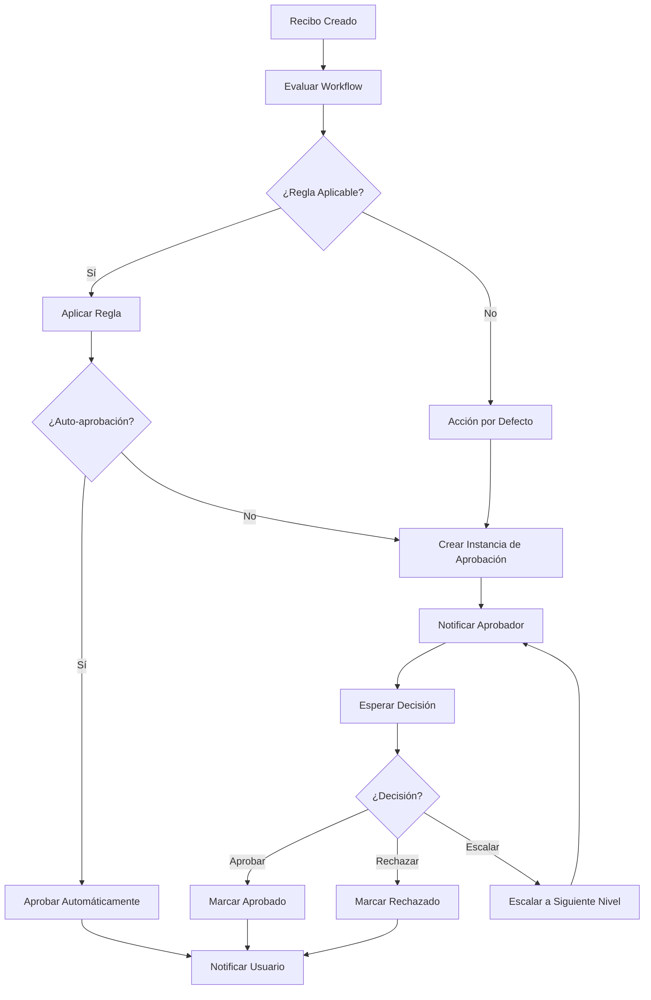

# Documentación Técnica - Sistema de Workflows de Gastify

## Arquitectura del Sistema

### Componentes Principales

```
┌─────────────────────────────────────────────────────────────┐
│                    Sistema de Workflows                     │
├─────────────────────────────────────────────────────────────┤
│                                                             │
│  ┌─────────────────┐  ┌─────────────────┐  ┌─────────────┐ │
│  │   Workflow      │  │   Workflow      │  │ Notification│ │
│  │   Engine        │  │   Service       │  │  Service    │ │
│  │                 │  │                 │  │             │ │
│  │ • Evaluación    │  │ • CRUD          │  │ • Alerts    │ │
│  │ • Reglas        │  │ • Instancias    │  │ • Emails    │ │
│  │ • Condiciones   │  │ • Analytics     │  │ • Real-time │ │
│  └─────────────────┘  └─────────────────┘  └─────────────┘ │
│           │                     │                   │       │
│           └─────────────────────┼───────────────────┘       │
│                                 │                           │
├─────────────────────────────────┼───────────────────────────┤
│                    Base de Datos │                          │
│                                 │                           │
│  ┌─────────────┐  ┌─────────────┐  ┌─────────────────────┐  │
│  │ Workflows   │  │ Approval    │  │ Organization        │  │
│  │ Collection  │  │ Instances   │  │ Roles               │  │
│  │             │  │ Collection  │  │ Collection          │  │
│  └─────────────┘  └─────────────┘  └─────────────────────┘  │
└─────────────────────────────────────────────────────────────┘
```

### Flujo de Procesamiento



## Modelos de Datos

### WorkflowModel

```python
class WorkflowModel(BaseModel):
    id: Optional[PyObjectId] = Field(default=None, alias="_id")
    company_id: str  # ID de la empresa
    name: str
    description: Optional[str] = None
    status: WorkflowStatus = WorkflowStatus.DRAFT
    rules: List[WorkflowRule] = []
    default_action: ApprovalAction = ApprovalAction.REQUIRE_APPROVAL
    created_by: str
    created_at: datetime = Field(default_factory=datetime.utcnow)
    updated_at: Optional[datetime] = None
    is_default: bool = False
```

### WorkflowRule

```python
class WorkflowRule(BaseModel):
    id: str = Field(default_factory=lambda: str(ObjectId()))
    name: str
    description: Optional[str] = None
    conditions: List[WorkflowCondition]
    condition_logic: str = "AND"  # AND/OR
    action: ApprovalAction
    priority: int = 0  # Mayor número = mayor prioridad
    escalation_user_id: Optional[str] = None
    escalation_role: Optional[str] = None
    auto_approve_limit: Optional[float] = None
```

### WorkflowCondition

```python
class WorkflowCondition(BaseModel):
    field: str  # Campo a evaluar
    operator: ConditionOperator
    value: Any  # Valor a comparar
    description: Optional[str] = None
```

### ApprovalInstance

```python
class ApprovalInstance(BaseModel):
    id: Optional[PyObjectId] = Field(default=None, alias="_id")
    receipt_id: str
    workflow_id: str
    company_id: str
    status: ApprovalStatus = ApprovalStatus.PENDING
    current_approver_id: Optional[str] = None
    current_approver_role: Optional[str] = None
    applied_rule_id: Optional[str] = None
    approval_chain: List[Dict[str, Any]] = []
    created_at: datetime = Field(default_factory=datetime.utcnow)
    updated_at: Optional[datetime] = None
    due_date: Optional[datetime] = None
    escalation_count: int = 0
    comments: List[Dict[str, Any]] = []
```

## Motor de Workflow (WorkflowEngine)

### Algoritmo de Evaluación

```python
async def evaluate_receipt(
    self,
    receipt: ReceiptModel,
    user: UserModel,
    workflow: WorkflowModel,
    user_roles: List[str] = None
) -> WorkflowEvaluation:
    """
    1. Preparar contexto de evaluación
    2. Ordenar reglas por prioridad (descendente)
    3. Evaluar cada regla hasta encontrar coincidencia
    4. Aplicar acción de la regla o acción por defecto
    5. Determinar siguiente aprobador si es necesario
    6. Calcular confianza de la decisión
    """
```

### Contexto de Evaluación

El motor prepara un contexto con todos los datos relevantes:

```python
context = {
    # Datos del recibo
    "amount": float(receipt.total),
    "category": receipt.category,
    "merchant": receipt.merchant,
    "date": receipt.date,
    "description": receipt.description or "",
    
    # Datos del usuario
    "user_id": str(user.id),
    "user_role": user.role,
    "user_roles": user_roles or [],
    "user_email": user.email,
    
    # Datos calculados
    "day_of_week": receipt.date.weekday(),
    "month": receipt.date.month,
    "is_weekend": receipt.date.weekday() >= 5,
    
    # Datos de ubicación (si disponibles)
    "has_location": hasattr(receipt, 'locationData'),
    "location_city": location_data.get("city", ""),
    "location_country": location_data.get("country", ""),
}
```

### Evaluadores de Condiciones

```python
condition_evaluators = {
    ConditionOperator.EQUALS: self._equals,
    ConditionOperator.NOT_EQUALS: self._not_equals,
    ConditionOperator.GREATER_THAN: self._greater_than,
    ConditionOperator.LESS_THAN: self._less_than,
    ConditionOperator.GREATER_EQUAL: self._greater_equal,
    ConditionOperator.LESS_EQUAL: self._less_equal,
    ConditionOperator.CONTAINS: self._contains,
    ConditionOperator.NOT_CONTAINS: self._not_contains,
    ConditionOperator.IN: self._in,
    ConditionOperator.NOT_IN: self._not_in,
}
```

## Servicio de Workflow (WorkflowService)

### Operaciones CRUD

```python
class WorkflowService:
    async def create_workflow(self, workflow_data: WorkflowCreate, company_id: str, created_by: str) -> WorkflowModel
    async def get_workflow(self, workflow_id: str, company_id: str) -> Optional[WorkflowModel]
    async def list_workflows(self, company_id: str) -> List[WorkflowModel]
    async def update_workflow(self, workflow_id: str, company_id: str, workflow_update: WorkflowUpdate) -> Optional[WorkflowModel]
    async def delete_workflow(self, workflow_id: str, company_id: str) -> bool
    async def get_default_workflow(self, company_id: str) -> Optional[WorkflowModel]
```

### Gestión de Instancias de Aprobación

```python
async def evaluate_receipt_approval(self, receipt: ReceiptModel, user: UserModel, company_id: str) -> WorkflowEvaluation
async def create_approval_instance(self, receipt_id: str, evaluation: WorkflowEvaluation, company_id: str) -> ApprovalInstance
async def process_approval_decision(self, instance_id: str, decision: ApprovalDecision, approver_id: str, company_id: str) -> ApprovalInstance
async def list_pending_approvals(self, company_id: str, approver_id: str = None, approver_role: str = None) -> List[ApprovalInstance]
```

## Sistema de Notificaciones

### WorkflowNotificationService

```python
class WorkflowNotificationService:
    async def notify_approval_required(self, approval_instance: ApprovalInstance, receipt_data: Dict, approver_user: UserModel) -> bool
    async def notify_approval_decision(self, approval_instance: ApprovalInstance, decision: ApprovalAction, receipt_data: Dict, submitter_user: UserModel, approver_user: UserModel) -> bool
    async def notify_auto_approval(self, approval_instance: ApprovalInstance, receipt_data: Dict, submitter_user: UserModel, rule_name: str) -> bool
    async def notify_escalation(self, approval_instance: ApprovalInstance, receipt_data: Dict, new_approver_user: UserModel, escalated_by_user: UserModel) -> bool
    async def notify_overdue_approval(self, approval_instance: ApprovalInstance, receipt_data: Dict, approver_user: UserModel) -> bool
```

### Tipos de Notificaciones

| Tipo | Descripción | Destinatario |
|------|-------------|--------------|
| `approval_required` | Nueva aprobación requerida | Aprobador |
| `approval_approved` | Gasto aprobado | Solicitante |
| `approval_rejected` | Gasto rechazado | Solicitante |
| `approval_escalated` | Gasto escalado | Solicitante + Nuevo Aprobador |
| `auto_approved` | Auto-aprobación | Solicitante |
| `approval_overdue` | Aprobación vencida | Aprobador |
| `workflow_updated` | Workflow actualizado | Administradores |
| `daily_summary` | Resumen diario | Aprobadores |

## Plantillas Predefinidas para Chile

### ChileanWorkflowTemplates

#### Workflow Básico
- **Auto-aprobación**: ≤ 50.000 CLP
- **Aprobación requerida**: 50.001 - 500.000 CLP
- **Escalación**: > 500.000 CLP

#### Workflow Empresarial
- **Auto-aprobación gastos oficina**: Categorías específicas ≤ 100.000 CLP
- **Aprobación viajes**: Todas las categorías de viaje
- **Escalación gastos representación**: > 200.000 CLP

```python
@staticmethod
def get_basic_approval_workflow() -> List[WorkflowRule]:
    return [
        WorkflowRuleBuilder.create_amount_rule(
            name="Auto-aprobación montos pequeños",
            amount_limit=50000,  # 50.000 CLP
            operator=ConditionOperator.LESS_EQUAL,
            action=ApprovalAction.APPROVE,
            priority=100
        ),
        # ... más reglas
    ]
```

## Base de Datos

### Colecciones MongoDB

#### workflows
```javascript
{
  _id: ObjectId,
  company_id: String,
  name: String,
  description: String,
  status: String, // "active", "inactive", "draft"
  rules: [
    {
      id: String,
      name: String,
      description: String,
      conditions: [
        {
          field: String,
          operator: String,
          value: Mixed,
          description: String
        }
      ],
      condition_logic: String, // "AND", "OR"
      action: String, // "approve", "reject", "require_approval", "escalate"
      priority: Number,
      escalation_user_id: String,
      escalation_role: String,
      auto_approve_limit: Number
    }
  ],
  default_action: String,
  created_by: String,
  created_at: Date,
  updated_at: Date,
  is_default: Boolean
}
```

#### approval_instances
```javascript
{
  _id: ObjectId,
  receipt_id: String,
  workflow_id: String,
  company_id: String,
  status: String, // "pending", "approved", "rejected", "escalated", "auto_approved"
  current_approver_id: String,
  current_approver_role: String,
  applied_rule_id: String,
  approval_chain: [
    {
      approver_id: String,
      action: String,
      comment: String,
      timestamp: Date
    }
  ],
  created_at: Date,
  updated_at: Date,
  due_date: Date,
  escalation_count: Number,
  comments: [
    {
      user_id: String,
      comment: String,
      timestamp: Date
    }
  ]
}
```

#### organization_roles
```javascript
{
  _id: ObjectId,
  company_id: String,
  name: String,
  description: String,
  level: Number, // Nivel jerárquico
  approval_limit: Number, // Límite de aprobación en CLP
  can_approve_categories: [String],
  parent_role_id: String,
  created_at: Date
}
```

#### user_role_assignments
```javascript
{
  _id: ObjectId,
  user_id: String,
  company_id: String,
  role_id: String,
  assigned_by: String,
  assigned_at: Date,
  is_active: Boolean
}
```

### Índices Recomendados

```javascript
// workflows
db.workflows.createIndex({ "company_id": 1, "is_default": 1 })
db.workflows.createIndex({ "company_id": 1, "status": 1 })

// approval_instances
db.approval_instances.createIndex({ "company_id": 1, "status": 1 })
db.approval_instances.createIndex({ "current_approver_id": 1, "status": 1 })
db.approval_instances.createIndex({ "receipt_id": 1 })
db.approval_instances.createIndex({ "due_date": 1, "status": 1 })

// organization_roles
db.organization_roles.createIndex({ "company_id": 1 })

// user_role_assignments
db.user_role_assignments.createIndex({ "user_id": 1, "company_id": 1, "is_active": 1 })
```

## Integración con Sistema de Recibos

### Modificaciones en create_receipt()

```python
# 1. Crear recibo en base de datos
result = await db.receipts.insert_one(receipt_data)
receipt_id = result.inserted_id

# 2. Evaluar workflow
workflow_evaluation = await workflow_service.evaluate_receipt_approval(
    receipt_for_workflow, current_user, company_id
)

# 3. Crear instancia de aprobación
approval_instance = await workflow_service.create_approval_instance(
    str(receipt_id), workflow_evaluation, company_id
)

# 4. Actualizar estado del recibo
new_status = "aprobado" if workflow_evaluation.auto_approved else "pendiente_aprobacion"
await db.receipts.update_one(
    {"_id": receipt_id},
    {"$set": {"status": new_status, "updatedAt": datetime.utcnow()}}
)

# 5. Enviar notificaciones
if workflow_evaluation.auto_approved:
    await notification_service.notify_auto_approval(...)
else:
    await notification_service.notify_approval_required(...)
```

## Optimizaciones de Performance

### Caché de Workflows
- Caché en memoria de workflows activos por empresa
- Invalidación automática en actualizaciones
- TTL configurable

### Evaluación Asíncrona
- Procesamiento de workflows en background
- Queue para evaluaciones masivas
- Rate limiting para prevenir sobrecarga

### Índices de Base de Datos
- Índices compuestos para consultas frecuentes
- Índices TTL para limpieza automática
- Particionado por empresa para escalabilidad

## Monitoreo y Logging

### Métricas Clave
- Tiempo promedio de evaluación de workflow
- Tasa de auto-aprobación por empresa
- Tiempo promedio de aprobación manual
- Tasa de escalación
- Errores de evaluación

### Logs Estructurados
```python
logger.info("Workflow evaluado", extra={
    "receipt_id": receipt_id,
    "workflow_id": workflow_id,
    "action": evaluation.action,
    "confidence": evaluation.confidence,
    "processing_time_ms": processing_time
})
```

## Seguridad

### Validaciones
- Verificación de permisos por empresa
- Validación de roles de aprobador
- Sanitización de condiciones de workflow
- Rate limiting en endpoints críticos

### Auditoría
- Log completo de todas las decisiones
- Trazabilidad de cambios en workflows
- Historial de aprobaciones inmutable

## Testing

### Cobertura de Tests
- Tests unitarios para motor de workflow
- Tests de integración para servicio completo
- Tests de carga para performance
- Tests de seguridad para validaciones

### Fixtures de Test
```python
@pytest.fixture
def basic_workflow():
    rules = ChileanWorkflowTemplates.get_basic_approval_workflow()
    return WorkflowModel(
        company_id="test_company",
        name="Test Workflow",
        rules=rules
    )
```

## Roadmap Técnico

### Fase 1 (Actual)
- ✅ Motor básico de workflow
- ✅ CRUD de workflows
- ✅ Instancias de aprobación
- ✅ Notificaciones básicas
- ✅ Plantillas para Chile

### Fase 2 (Próxima)
- 🔄 Machine Learning para optimización de reglas
- 🔄 Workflows condicionales avanzados
- 🔄 Integración con sistemas externos
- 🔄 Dashboard de analytics en tiempo real

### Fase 3 (Futuro)
- 📋 Workflows multi-empresa
- 📋 Aprobaciones por delegación
- 📋 Workflows temporales
- 📋 IA para detección de anomalías
